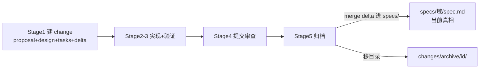

# changes/ — 变更工作区(specs ↔ changes ↔ archive)

> 替代旧 `plans/` + `archive/`。**`specs/`=当前真相,`changes/<id>/`=进行中的变化,`changes/archive/`=已合并**。
> 一个 change 一个目录 `<id>/`:proposal(为什么)+ design(怎么做)+ tasks(执行)+ specs/(delta)+ **implement.jsonl / check.jsonl**(实现/检查各读啥,精准加载 + 关注点分离)。
> 🛠️ **脚本化**:`bash .qey/change.sh create <id>`(建骨架)/ `archive <id>`(验 evidence + 助 delta merge + 移 archive + parity)——让生命周期真落地,不只靠 AI 自觉。
> **触发关系**:change 的**触发**是用户在 AI 会话描述需求(dev-loop Stage 0 意图+澄清 → Stage 1 设计拆解),**不是 CLI 命令**。`change.sh create` 是 Stage 1 的**可选工具**(快速建空骨架,AI 再填;也可直接 Write 照 `_template.md`)。`change.sh archive` 是 Stage 5 的**归档脚本**(机械操作,该用 CLI)。
> 模板:`_template.md`(无造假范例:change 由真实需求产生)。

## 生命周期

1. **Stage 1**(`[HITL:必须人工]` 审)→ 建 `changes/<id>/`,写 proposal + design + tasks + specs/(delta)
2. **Stage 2-3** → 按 tasks 勾选编码 + 验证(AC 绿)
3. **Stage 5**(`[HITL:必须人工]` 填)→ **归档前置 + 三步**:
   - **前置**:tasks.md 每 Scenario 的 **evidence 填齐**(RED/GREEN/回归,见 `_template.md`)
   - **① merge delta**:`changes/<id>/specs/<域>.md` 的 ADDED/MODIFIED/REMOVED apply 进 `specs/<域>/spec.md`(ADDED 追加、MODIFIED 覆盖、REMOVED 删除)
   - **② 移目录**:`changes/<id>/` → `changes/archive/<id>/`
   - **③ 加归档**:frontmatter(type/branch/merged/risk/commit)+ 实际改动/坑/上线回滚
   - 踩坑/决策已在 loop 当场写(`memory/`);`/recap` = 周期审计

## delta 语义(④)

- `specs/` = **当前真相**(代码应一致;不一致以 specs/ 为准或发新 change)
- `changes/<id>/specs/` = **只记变化**:ADDED(新行为)/ MODIFIED(老→新)/ REMOVED(移除)
- **归档 = 把 delta merge 进 specs/**,不是"移文件丢一边"——这样项目永远有一份演进的当前真相
- 改 specs/ 的行为 → 发新 change,不在 specs/ 直接改

## 改动类型分级(决定要不要建 change)

| 类型 | 建 change? | 处理 | 工具 |
|------|-----------|------|------|
| 新需求 | ✅ 完整(proposal+design+tasks+delta) | 全 6 阶段 | `/comet` |
| 复杂 bug | ✅ 简化(proposal=复现+根因,tasks=修复+回归,design 可选) | bug TDD | `/comet-hotfix`+`diagnose` |
| 简单 bug / tweak | ❌ 不建;踩坑当场写 `knowledge/踩坑记录/` | 直接改 | `bug排查-loop`/`/comet-tweak` |

> **判断**:需要规格+技术方案+任务清单 → 建 change;轻量 → 不建,走踩坑/直接改。
