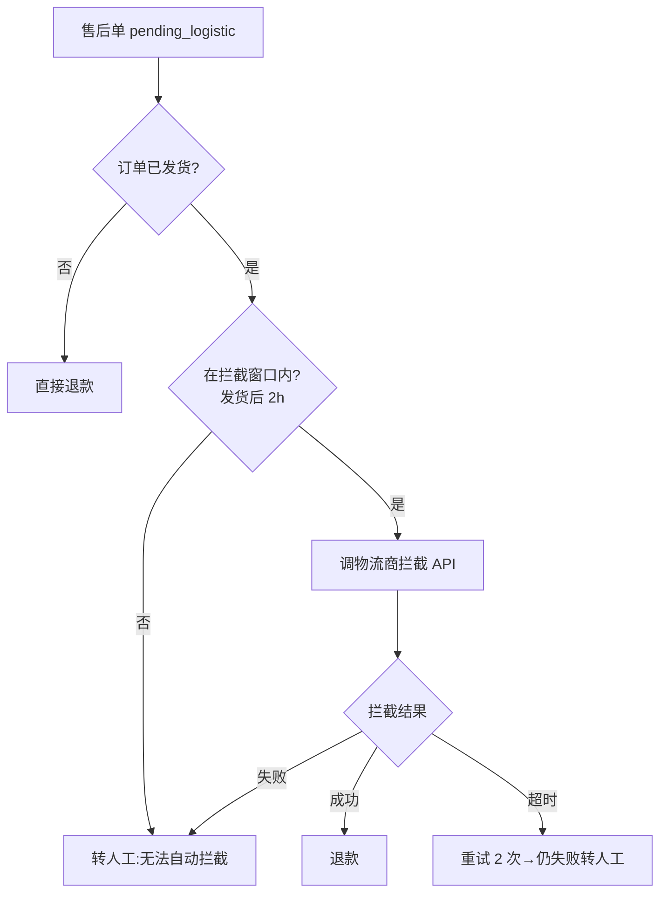

# Domain 深潜范例:售后物流拦截

> **这是完整填好的真实样本**——供 AI 写 domain 深潜时参考质量、深度、格式。
> 结构看 `_template.md`,质量看本文件。
> 何时建深潜:某域**常改/复杂/有坑/多人协作**(地图一行不够)→ 独立成文。

---

## 这域是什么

售后"已发货拦截":用户申请退款/退货时,系统判断订单是否已发货。已发货的售后单需走物流拦截流程(联系仓库拦截包裹),拦截成功才能退款;拦截失败则转人工处理。

## 为什么独立成文(升级信号)

- **常改**:拦截规则随物流商接入频繁调整(每接一个物流商改一次)
- **复杂**:涉及 3 个物流商 API + 2 套拦截策略(自动/人工)
- **有坑**:拦截时机有窗口期(发货后 2 小时内才能拦),踩过坑
- **多人协作**:前端/后端/仓库/客服都会碰

## 核心入口

- **锚点**:`AfterSaleLogisticService::tryIntercept` (app/Service/AfterSale/AfterSaleLogisticService.php) [observed]
- **锚点**:`AfterSaleLogisticService::checkInterceptWindow` (同上) [observed]
- **触发**:售后单状态变 `pending_logistic`(退款流程走到物流判断)时调 tryIntercept

## 主流程



## 状态流转

```
pending → pending_logistic → intercepting → intercepted(退款)
                                      ↓
                                  intercept_failed(人工)
```

## 物流商对接(3 家)

| 物流商 | API | 拦截策略 | 窗口期 |
|--------|-----|---------|--------|
| 顺丰 | sf.api/intercept | 自动 | 发货后 2h |
| 京东 | jd.api/stop | 自动 | 发货后 1h |
| 中通 | 无 API | 人工(工单) | 任意 |

## 常见坑(详见 knowledge/踩坑记录/售后.md)

- 顺丰拦截 API 超时默认 5 秒太短,高峰期需 10 秒
- 京东窗口期是 1 小时不是 2 小时(和顺丰不同,易混淆)
- 中通无 API 但前端仍显示"拦截中",需文案改为"人工处理中"

## 改本域前读

- `domain/业务流程.md` 售后行 — 售后全链路入口
- `domain/状态流程.md` — 售后状态机
- `knowledge/踩坑记录/售后.md` — 物流拦截坑
- `specs/售后/spec.md` — 售后行为契约(拦截不变量)
- `rules/外部调用规范.md` — 物流商 API 调用规范

## 相关 change

- `logistic-intercept-v2`(进行中):接入第 4 家物流商(圆通)
- `after-sale-refactor`(归档):售后流程重构
