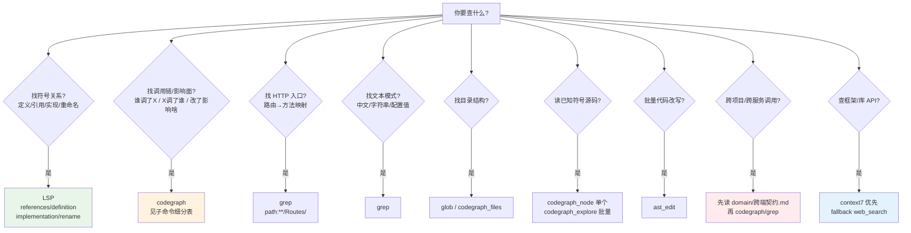

# 代码定位决策树(AI 必读)

> **我要定位/查 X,该用哪个工具?** 本决策树回答这个问题。
> 核心原则:**没有全局最优工具,只有任务匹配的工具**。`LSP > codegraph > grep` 这个排序是错的——按任务特征匹配。

---

## 决策树(先看这张图)



---

## 任务 → 工具决策表

| 问题类型 | 首选工具 | 为什么 |
|---------|---------|--------|
| **找符号定义** | `lsp definition` / `codegraph_search` | LSP 穿透 trait;codegraph 快 |
| **找谁调了某方法**(符号引用) | ⭐ **`lsp references`** | 穿透 trait/继承/接口,**零噪声** |
| **找调用链/影响面** | ⭐ **codegraph 子命令**(见下表) | 符号级调用图 |
| **找 HTTP 入口** | ⭐ **`grep path:"**/Routes/"`** | 路由是唯一真相,方法名会重复 |
| **找中文/字符串/配置值** | `grep` | LSP/codegraph 不索引文本 |
| **找目录结构** | `glob` / `codegraph_files` | 结构化列出,比 ls/find 强 |
| **读单个符号源码** | ⭐ **`codegraph_node`**(轻) | 比 explore 轻,只拉一个 |
| **批量读关联符号** | `codegraph_explore` | 一次拿相关符号群 |
| **改符号名**(重命名) | ⭐ **`lsp rename`** | 项目级一次改全,**不漏** |
| **批量代码改写**(codemod) | `ast_edit` | AST 结构改写,比 sed 安全 |
| **看变量的类型推导** | `lsp hover` | codegraph/grep 给不出类型 |
| **🆕 跨项目/跨服务调用** | ⭐ **先读 `domain/跨端契约.md`** → 再 codegraph/grep | 跨端边界先看契约,代码只在一侧 |
| **🆕 查框架/库官方 API** | ⭐ **context7** → fallback `web_search` | context7 拉官方文档,比训练记忆准 |

⭐ = 该任务下明显最优。

---

## codegraph 命令体系(重型 + 轻型)

> colbymchenry 原版有 10 个命令,分**重型**(Explore Agent 用,返回丰富上下文)和**轻型**(主会话直接用,精确查询)两组。不同 MCP 实现挂的工具不同——精简版可能缺重型命令。填表时按本项目实际挂载标 ✅/❌。

### 重型命令(返回丰富上下文,一次性替代多次 grep+Read)

| 命令 | 何时用 | 一次替代 | 缺失时的替代方案 |
|------|--------|---------|----------------|
| `codegraph_context` | **给任务描述,返回入口点+关联符号+代码片段**(一站式拿上下文) | 5-10 次 grep+Read | `search` 定位 → `callers`/`callees` 拿关联 → `explore` 批量读源码(三步凑) |
| `codegraph_trace` | **追踪 X 如何到达 Y 的完整调用路径**(含动态分发,处理回调/JSX/接口) | 20+ 次 Read+grep | `callers`(Y 的上游)→ `callees`(X 的下游)→ 人工拼路径;动态分发处用 LSP references 补 |
| `codegraph_explore` | **批量拿关联符号源码**(按文件分组+关系映射) | 10-15 次 Read | — |

### 轻型命令(精确查询,主会话直接用)

| 命令 | 何时用 | 一次替代 |
|------|--------|---------|
| `codegraph_search` | **按名找符号位置**(只返回 location) | 拿定义点 |
| `codegraph_callers` | **谁调了它**(上游调用者) | 反向 grep |
| `codegraph_callees` | **它调了谁**(下游被调者) | 正向 grep |
| `codegraph_impact` | **改 X 影响哪些地方**(爆炸半径) | **重构前必查** |
| `codegraph_node` | **单个符号详情+源码**(带 `includeCode=true`) | 1 次 read |
| `codegraph_files` | **索引文件树**(比 glob 快) | ls/find |
| `codegraph_status` | **索引健康检查** | — |

### 选型决策

**codegraph_node vs explore**:
- 查**一个**符号 → `node`(轻,带 includeCode 拿源码)
- 查**一群**关联符号 → `explore`(重,按文件分组批量拿)

**缺 context/trace 时怎么凑**:
- 想"任务描述→入口"(context 的活)→ `search` 拿定义 → `callers`/`callees` 扩散 → `explore` 批量读
- 想"X 到 Y 的完整路径"(trace 的活)→ `callers(Y)` ∪ `callees(X)` → 人工拼接中间层;动态分发处用 LSP references 补

---

## 三条"什么时候 NOT 用 X"

| 别用 | 场景 | 为什么 | 用什么代替 |
|------|------|--------|-----------|
| **别用 LSP 找字符串** | 找中文注释、配置值、字面量、文案 | LSP 只懂符号 | grep |
| **别用 codegraph 搜中文** | codegraph 只索引英文符号 | 中文必 0 结果 | grep(可搜 domain md) |
| **别用 grep 找符号关系** | trait 方法引用、接口实现、继承链 | grep 漏报严重 + 大量同名噪声 | LSP |

---

## 四大工具能力边界

| 能力 | LSP | codegraph | grep | context7 |
|------|-----|-----------|------|----------|
| 穿透 trait/继承/接口 | ⭐⭐⭐ | ⭐⭐(部分) | ❌ | ❌ |
| 调用图(callers/callees/impact) | ⭐(references 近似) | ⭐⭐⭐ | ❌ | ❌ |
| 找文本模式 | ❌ | ❌ | ⭐⭐⭐ | ❌ |
| 找 HTTP 路由 | ❌ | ❌ | ⭐⭐⭐ | ❌ |
| 项目级重命名 | ⭐⭐⭐ | ❌ | ⭐(易漏) | ❌ |
| 类型推导/hover | ⭐⭐⭐ | ❌ | ❌ | ❌ |
| **查框架/库官方 API** | ❌ | ❌ | ❌ | ⭐⭐⭐ |
| 首次冷启动成本 | 高(大仓数分钟) | 中(索引已建) | 无 | 无(实时拉) |
| 稳态速度 | 秒级 | 秒级 | 秒级 | 秒级 |

**关键**:LSP 强在符号关系准确性,codegraph 强在调用图宏观,context7 强在框架官方文档。三者互补不冲突。

---

## 反模式

- ❌ **grep 找 trait 方法引用** → 大量同名方法噪声 + trait 间接调用全漏
- ❌ **codegraph 搜中文** → 必 0 结果(只索引英文符号)
- ❌ **codegraph_explore 问宽泛自然语言** → 被 budget 截断,要带具体符号名
- ❌ **read 整文件不带 offset/limit** → 大 Controller 几千行,信息密度低
- ❌ **该并行的不并行** → 符号定位 + 调用关系 + 路由 grep 应第一轮并行发出
- ❌ **查询型任务先读 domain 全文** → 多一次往返,domain 是可选补充
- ❌ **查框架 API 靠训练记忆** → 可能过时,优先 context7 拉官方文档
- ❌ **`codegraph_node` 传 `includeCode:false`** → 只给类位置,拿不到方法清单,空转;要源码传 `true`,要方法清单用 `codegraph_explore` 或 `read :offset`
- ❌ **grep 业务词查"用了某技术/CLI 的功能"** → 噪声爆炸。查 OCR/PDF/图像/视频类功能,**grep 工具名/库名**(tesseract/zbar/ffmpeg/imagick/pdftotext)而非业务词("面单"/"识别"/"图片")—— 工具名零业务噪声,业务词撞文案/注释/提示词


## grep 进阶技巧(查得准的钥匙)

grep 本身快,慢在 pattern 选错导致噪声爆炸。三条进阶技巧:

| 技巧 | 说明 |
|------|------|
| **① 路径收窄** | 别全仓搜,收窄到子域/路由目录(如 `path:"**/Routes/"` / `path:"**/Services/<域>/"`) |
| **② 查技术功能用工具名,不用业务词** | OCR/PDF/图像/视频/支付类功能,grep 库名/CLI 名而非中文业务词——工具名零业务噪声,业务词撞文案/注释/提示词。常见:tesseract/zbar/ffmpeg/imagick/pdftotext/tcpdf/dompdf |
| **③ 查符号用 codegraph/LSP,不用 grep** | grep 找方法调用会撞同名方法 + 漏 trait/动态调用 |

> 一句话:**路径窄、词精准、符号交给 codegraph/LSP**——grep 的活是找文本(中文/字符串/路由/工具名),不是找符号关系。
---

## 实证数据(项目初始化后积累)

> 以下是**示例实证**,项目初始化后替换成本项目真实案例。实证是决策表的反模式论据——比抽象规则更直观,AI 看到数据会更信。

### 实证模板(填本项目数据)

| 维度 | 工具A | 工具B |
|------|------|------|
| 结果数 | ? | ? |
| 精确率 | ?% | ?% |
| 噪声数 | ? | ? |
| 一击定位 | ✅/❌ | ✅/❌ |

**结论**:[一句话规律]。

### 实证样本:OCR/技术功能查找 — 工具名 vs 业务词(grep pattern 选错=灾难)

**场景**:查项目里"用 OCR/图像处理/视频转码"等功能实现(任何语言通用)。

| 维度 | **grep 工具名/库名** | **grep 业务词** |
|------|---------------------|---------------------|
| 结果数 | **几文件,零噪声** ⭐ | 几十~上百文件 |
| 精确率 | **命中核心实现** ⭐ | 大量文案/注释/提示词噪声 |
| 一击定位 | ✅ 第一轮命中 | ❌ 需多轮去噪 |

**业务词噪声来源**:文案、注释、提示词、配置项里的业务词——全是非代码噪声。

**结论**:查"用了某技术/CLI 工具的功能",**grep 工具名/库名**,不 grep 业务词。工具名零业务噪声,业务词撞文案/注释/提示词。

**常见工具名速查**(按需补充本项目用的):
- 图像/OCR:tesseract / zbar / imagick / pdftotext
- 视频:ffmpeg
- PDF:tcpdf / dompdf / pdftotext
- 支付:Stripe / PayPal / AlipaySDK
- 队列/缓存:redis / rabbitmq amqp

**最优路径**:
```
① grep "tesseract|zbar|ffmpeg|imagick"(工具名)  ★ 一击锁实现类
   或 codegraph_search "<推测的实现类名>"
② read 实现类源码 + codegraph_callers <核心方法>  ★ 找调用入口
```

## 查询型任务的并行 SOP

「入口在哪 / 流程怎么走 / X 调用了谁」这类**不改代码**的查询:

| 步骤 | 工具 | 备注 |
|------|------|------|
| 1. 符号定位 | `codegraph_search "SymbolName"` | 拿定义位置 |
| 2. 调用关系 | `codegraph_callers` / `callees` / `impact` | 按目的选子命令 |
| 3. HTTP 入口 | `grep path:"**/Routes/"` | 拿路由→方法映射 |
| 4. 符号引用(trait/接口) | `lsp references` | 穿透 trait,零噪声 |
| 5. 源码(仅当 1-4 不够) | `codegraph_node`(单个)/ `codegraph_explore`(批量) | 别用自然语言问 |

**⭐ 1/2/3/4 第一轮并行发出**,不要串行。
**⭐ 改代码型任务另查 domain + 陷阱文档**,防命名踩坑。

---

## 语言相关的 LSP 配置(项目初始化时填)

本项目是 **[项目语言]**,LSP server 是 **[server 名]**,安装命令:`[install cmd]`,rootMarker:`[marker]`。

常见语言速查:

| 语言 | LSP server | 安装 | rootMarker |
|------|-----------|------|-----------|
| PHP | intelephense | `npm install -g intelephense` | composer.json |
| Python | pyright | `npm install -g pyright` | pyproject.toml/setup.py |
| TypeScript/JS | typescript-language-server | `npm install -g typescript-language-server typescript` | package.json/tsconfig.json |
| Go | gopls | `go install golang.org/x/tools/gopls@latest` | go.mod |
| Java | jdtls | 下载 jdtls(需 JDK) | pom.xml/build.gradle |
| Ruby | ruby-lsp | `gem install ruby-lsp` | Gemfile |

OMP 自动检测条件:server 二进制在 PATH + 项目有 rootMarker → 零配置启动。每个项目首次冷启动索引慢,之后秒级。

---

## 维护

- 工具能力会演进(LSP/codegraph/context7 新功能)→ 发现新能力更新本表
- 实证数据要带日期 `(YYYY-MM)` → 工具版本变化后重新验证
- 项目初始化时:填「语言相关的 LSP 配置」段
