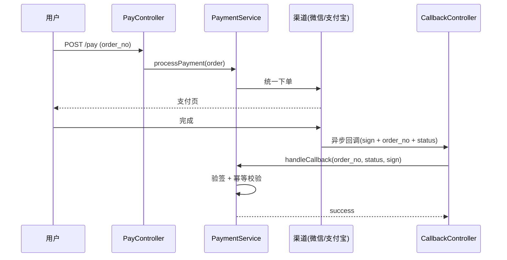

# Spec 范例:支付域

> **这是完整填好的真实样本**——供 AI 写 spec 时参考质量、深度、格式。
> 结构看 `_template.md`,质量看本文件。
> 场景:电商订单支付(下单→支付→回调→状态流转)。

---

```yaml
domain: 支付
last_verified: 2026-08-05
source: scan 基线 + pay-refactor change 归档 merge
```

# Spec:订单支付

## 当前行为

用户下单后,系统调 PaymentService 发起支付(当前支持微信/支付宝)。支付渠道异步回调,回调成功后订单状态从"待支付"流转到"已支付"。回调带签名验证,重试 3 次,幂等处理(同一 order_no 只处理首次成功回调)。

## 主流程



## 关键约束 / 不变量(可验证)⭐

### 回调幂等

- **签名**:`PaymentService::handleCallback(string $orderNo, string $status, string $sign): bool`
- **契约**:同一 orderNo 的回调只处理首次;重复回调返回 true 但不重复改状态;验签失败抛 InvalidSignException
- **验证断点**:`testCallbackIdempotent`(tests/Payment/CallbackTest.php)— 重复回调不改状态
- **置信度**:[observed]

### 状态唯一入口

- **签名**:`OrderStateMachine::transition(int $orderId, string $to): void`
- **契约**:所有订单状态变更必须经此方法;非法转换(如"已支付"→"待支付")抛 InvalidTransitionException
- **验证断点**:`testInvalidTransitionThrows` + `testPendingToPaidOk`
- **置信度**:[observed]

### 支付超时关单

- **签名**:`PaymentService::closeExpired(int $orderId): bool`
- **契约**:待支付订单超 30 分钟自动关单;关单后不可再支付
- **验证断点**:`testAutoCloseAfterTimeout`
- **置信度**:[⚠️待确认](定时任务频率未确认)

## 入口符号(hint,用前 codegraph 验证)

- `PaymentService::processPayment` (app/Service/Payment/PaymentService.php) [observed]
- `PaymentService::handleCallback` (app/Service/Payment/PaymentService.php) [observed]
- `PayController::pay` (app/Http/Controllers/PayController.php) [observed]
- `CallbackController::notify` (app/Http/Controllers/CallbackController.php) [observed]
- `OrderStateMachine::transition` (app/Order/OrderStateMachine.php) [⚠️待确认]

> 入口符号是 hint;`qey verify` 自动查这些符号还在不在。改行为 → 发新 change,merge delta 进本文件。

## 改本域前读(Pre-Dev Checklist)

- `domain/业务流程.md` 支付行 — 链路入口(hint)
- `domain/状态流程.md` — 订单状态机(mermaid)
- `knowledge/踩坑记录/支付.md` — 回调签名/幂等历史坑
- 本文件「关键约束」— 改前行为真相
- `rules/安全规范.md` — 支付涉及金额,安全底线
- `rules/外部调用规范.md` — 渠道 API 调用(超时/重试/幂等)

## 完成前查(Quality Check)

- [ ] AC 逐条 evidence 齐(RED+GREEN+回归)— 见 change `tasks.md`
- [ ] 本文件「关键约束」未被破坏(签名还在?契约满足?)
- [ ] 改动触及行为 → 写 delta + merge 回本文件
- [ ] `qey verify` 无过期(所有锚点符号仍存在)
- [ ] 回归测试通过 + lint / typecheck
