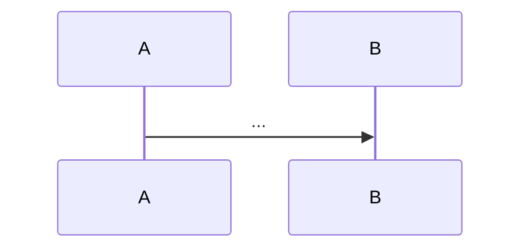

# Spec 模板:`<域>`

> 复制到 `specs/<域>/spec.md`。**当前行为真相**(代码应一致)。
> **两个来源**:① qey:scan 从现有行为提炼**基线**(标置信度);② change 归档时 **merge delta**。
> **改行为 → 发新 change,不在 spec 直接改。**
>
> 📖 **填写参考**:看 `specs/_example.md`(支付域完整范例)——参考质量、深度、可验证结构的写法。

---

```yaml
domain: <域>
last_verified: YYYY-MM-DD
source: <scan 基线 / change 归档 merge>
```

# Spec:<域标题>

## 当前行为
<一段话:这域现在做什么>

## 主流程(mermaid)


## 关键约束 / 不变量(可验证)⭐

> **2.0 增强**:每条约束带签名 + 验证方式。`qey verify` 自动校验签名存在性。

### <不变量 1:如 回调幂等>
- **签名**:`CallbackService::handleCallback(string $orderId): bool`
- **契约**:同一 orderId 重复回调只处理一次;返回 true 处理成功
- **验证断点**:`testCallbackIdempotent`(tests/CallbackTest.php)
- **置信度**:[observed|⚠️待确认]

### <不变量 2:如 状态唯一入口>
- **签名**:`OrderStateMachine::transition(int $orderId, string $to): void`
- **契约**:所有状态变更必须经此方法;非法转换抛 InvalidTransition
- **验证断点**:`testInvalidTransitionThrows`
- **置信度**:[observed]

## 入口符号(hint,用前 codegraph 验证)
- `PaymentService::processPayment` (app/Service/PaymentService.php) [observed]
- `OrderLogic::createOrder` (app/Order/OrderLogic.php) [⚠️待确认]

> 入口符号是 hint;domain 给方向,代码给真相。`qey verify` 自动查这些符号还在不在。

## 改本域前读(Pre-Dev Checklist)
- `domain/业务流程.md` + `状态流程.md` — 本域流程/状态(hint)
- `knowledge/踩坑记录/<域>.md` — 本域历史坑(若有)
- 本文件「关键约束 / 不变量」— 改前行为真相
- 相关 `rules/`(如改支付 → 安全规范 / 外部调用规范)

## 完成前查(Quality Check)
- [ ] AC 逐条 evidence 齐(RED+GREEN+回归)— 见 change `tasks.md`
- [ ] 本文件「关键约束」未被破坏(签名还在?契约满足?)
- [ ] 改动触及行为 → 写 delta + merge 回本文件
- [ ] `qey verify` 无过期(所有锚点符号仍存在)
- [ ] 回归测试通过 + lint / typecheck
