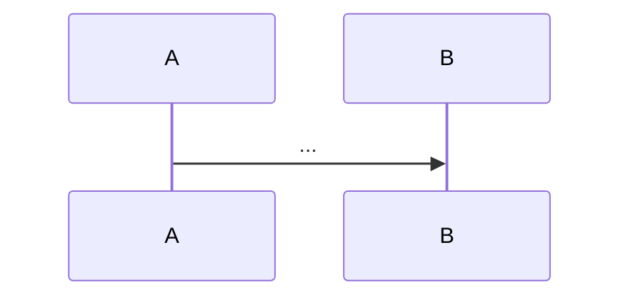
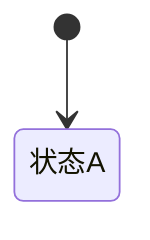

# 业务领域目录(可选记录 — opt-in)

> 本目录用**三级粒度**:
> - `<域>.md` = **域索引**(概述 + 模块清单 + 指向子文件;像 domain-map 之于 业务领域)
> - `<域>/<子主题>.md` = **子主题深潜**(流程图/状态机/数据/陷阱;一次会话只动一个,不污染巨物)
> - 只给 **常改/复杂/易踩坑** 的域/子主题建,不全覆盖(全覆盖=上下文爆炸,没人维护)。
> ⭐ **范例**:看本目录已填的领域文档(qey-init 后由项目填充)。

## 何时升级?(三级粒度信号)

### Level 1 → Level 2:从「业务流程.md 一行」升级为「`<域>.md` 索引」

业务流程.md 每域都有一行(地图层)。**满足任一信号 → 建域索引**:

| 信号 | 升级 |
|------|------|
| **常改** | 这域反复出现在 git log(最近改动都碰它) |
| **复杂** | 多流程 + 状态机(如订单下单:创单→预审→寻源→占库→出库→发货→售后) |
| **有坑** | 已记 `knowledge/踩坑记录/<域>` 或排查很久 |
| **多人协作** | 多人改这域,需共享心智模型 |

### Level 2 → Level 3:从「`<域>.md` 巨物」升级为「`<域>/<子主题>.md`」⭐

> 当 `<域>.md` 膨胀成巨物(多模块/多流程全塞一个文件),拆子主题。**一次会话只梳理一个子主题 → 只动一个子文件。**

| 信号 | 拆子主题 |
|------|---------|
| **文件过大** | `<域>.md` 超过 ~200 行 / 5+ 模块全塞,难独立理解 |
| **子主题独立** | 某子主题(如售后里的"物流拦截"/"退款"/"审核")能独立成文,不必依赖全域 |
| **频繁局部改** | 反复改域内某个子流程(如售后拦截逻辑),但不动其他模块 |
| **会话聚焦** | 一次会话只梳理一个子主题 → 独立成文,不叠进巨物 |

**拆法**:`<域>.md` 退化为索引(概述 + 模块清单 + `[[子主题]]` 链接),子主题进 `<域>/<子主题>.md`。

> **大域通常够格拆子主题**:售后(拦截/退款/审核/定责/物流)/ 订单(下单/状态机/推单)/ 支付(收银台/回调/对账)。
> **小/稳的域留地图**:配置 / 枚举 / 简单 CRUD——一行说清,不建 md。
> **地图↔深潜 链接**:业务流程.md 的行,若该域有深潜,加链接(如 `[订单](../业务领域/订单.md)`)。

## 怎么决定记不记

| 记录策略 | 标记 | 说明 |
|---------|------|------|
| 要记 | ✅ | 常改/复杂/有陷阱/多人协作 → 建独立文件 |
| 待记 | ⬜ | 计划记但还没写 |
| 不记 | ➖ | 简单/不常动/domain-map 够用 |

## 业务领域清单

| 业务领域 | 记录 | 入口/关键文件 | 详情 |
|---------|------|-------------|------|
| <领域1> | ⬜ | | 待记 |

## 每个领域文件的模板(概述/流程图/状态/数据/陷阱/关系)

```markdown
# <领域名>

> 一句话定位 + 关联(domain-map/术语/踩坑)。

## 业务概述
<是什么/核心价值/与其他域区别>

## 核心流程(mermaid)


## 状态流转(状态机类领域)

| 状态 | 触发 | 说明 |
|------|------|------|

## 关键代码(符号 类::方法 优先,行号带日期)
### Controller / Service / Model / Enum

## 数据模型(核心表 + 关键字段)
| 表 | 作用 | 关键字段 |
|----|------|---------|

## 边界与陷阱(→ knowledge/踩坑记录/<域>)

## 与其他域关系
| 关联域 | 关系 |
|--------|------|
```

> 已记的领域,文件名用领域名(如 `订单.md`)。维护时改上面清单的标记即可。
