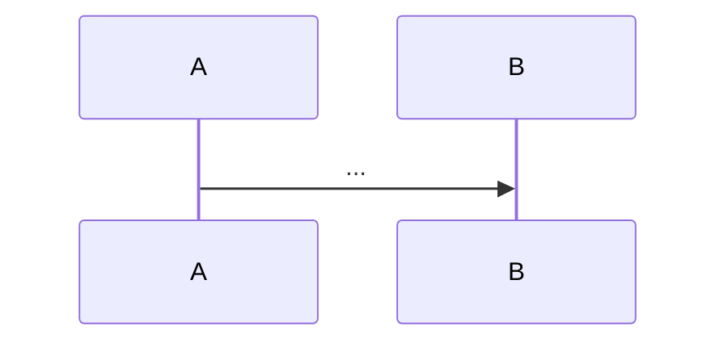

# Spec 模板:`<域>`

> 复制到 `specs/<域>/spec.md`,填。**当前行为真相**(代码应一致)。
> **两个来源**:① qey-init 从现有行为提炼**基线**(标置信度);② change 归档时 **merge delta**(ADDED/MODIFIED/REMOVED)。
> (无造假范例:spec 由 init 基线 + change merge 产生,照下面结构填)
> **改这里的行为 → 发新 change(`changes/<id>/`),不在 spec 直接改。**

---

```yaml
# frontmatter(可选)
domain: <域>
last_verified: YYYY-MM-DD   # freshness;老了 → 用前验证(代码是 truth,spec 可能 stale)
source: <init 扫描 / change 归档 merge>
```

# Spec:<域标题>

## 当前行为
<一段话:这域现在做什么>

## 主流程(mermaid)


## 关键约束 / 不变量 ⭐ 行为契约,代码必须满足
- <不变量 1:如 回调幂等 / 对账一致性 / 状态唯一入口>
- <不变量 2>

## 入口符号(hint,用前 codegraph 验证还在)
- <`类::方法` / API 路径>
- <`类::方法`>

> 入口符号是 hint;`domain/给方向,代码给真相`——用前验证。改行为 → 发新 change,merge delta 进本文件。

## 改本域前读(Pre-Dev Checklist)
> 改本域代码前,按需先读:
- `domain/业务流程.md` + `状态流程.md` — 本域流程/状态(hint)
- `knowledge/踩坑记录/<域>.md` — 本域历史坑(若有)
- `specs/<域>/spec.md`(本文件) — 改前行为真相(对照你要改的)
- 相关 `rules/`(如改支付 → 安全规范 / 外部调用规范)

## 完成前查(Quality Check)
> 改完本域,逐条验证:
- [ ] AC 逐条 evidence 齐(RED+GREEN+回归)— 见 change `tasks.md`
- [ ] 本文件「关键约束 / 不变量」未被破坏(代码仍满足契约)
- [ ] 改动触及行为 → 写 delta(ADDED/MODIFIED/REMOVED)+ merge 回本文件
- [ ] 回归测试通过 + lint / typecheck
