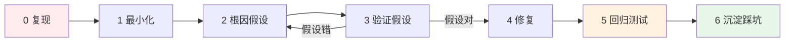

# Bug 排查 Loop(复现 → 根因 → 修复 → 回归)

> 正在发生的 bug 用这个 loop(已解决的沉淀走 `knowledge/踩坑记录/`)。
> 与 `diagnose` skill / `/comet-hotfix` 对齐;**本文件是 harness 内的排查流程入口**。
> 核心原则:**先复现再修**——不能稳定复现的 bug 不要急着改。

## 阶段总览

| 阶段 | 动作 | 人工? |
|------|------|------|
| 0 **复现** | 稳定复现;记下精确触发条件(输入/数据/时序/并发) | `[HITL:必须人工]` 提供线索 |
| 1 **最小化** | 砍掉无关因素,缩到最小复现用例 | `[HITL:AI自动]` |
| 2 **根因假设** | 列 2-3 个候选根因;用 codegraph_callers/impact 查影响面 | `[HITL:人审]` |
| 3 **验证假设** | 加日志/断点/临时断言,确认是哪个根因(不是猜) | `[HITL:AI自动]` |
| 4 **修复** | 最小改动修根因(不修症状);bug 的 TDD:复现条件=AC→回归测试 | `[HITL:人审]` |
| 5 **回归** | 跑回归(含本次 AC 测试)+ 影响面回归 | `[HITL:必须人工]` 确认 |
| 6 **沉淀** | **当场写** `knowledge/踩坑记录/<域>.md`(坑/根因/怎么避/证据 + freshness,格式见 `_template.md`)——不拖到 /recap | `[HITL:必须人工]` 填 |

## bug 复现模板(区别于新需求 spec;填完进踩坑记录)

- **症状**:实际发生了什么(非期望行为)
- **复现步骤**:1. ... 2. ... 3. ...(精确到可重复)
- **期望**:应该发生什么
- **根因**:验证后的真正原因 + `file:line`
- **影响面**:codegraph_impact 查到的受影响符号/文件
- **修复**:改了什么(最小改动)
- **回归断言**:`test_xxx` 断言 ...(防止回退)

## 先读哪个 .qey

- 入口/调用方 → `domain/业务流程.md` + codegraph_callers
- 状态相关 → `domain/状态流程.md`
- 历史坑 → `knowledge/踩坑记录/<域>.md`
- 分层/写法 → `rules/各层规范.md`

> **绝不**:症状未定位根因就改代码 / 不能复现就"试试看"改 / 改完不跑回归。
