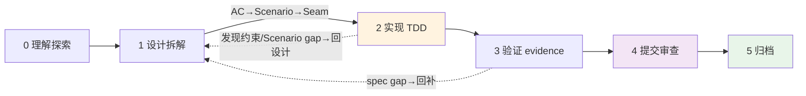

# 新需求开发 Loop(6 阶段 + 规格↔测试融合)

> **理解 → 设计拆解 → 实现 → 验证 → 提交审查 → 归档**,6 阶段。
> 规格设计(Stage 0-1)管"做什么",TDD(Stage 2-3)管"做对没";**AC 是两者之间的桥**。
> **本文件是权威流程**;执行引擎按需调用,不替代本流程。

## 治理边界声明(两套机制各管一摊,防概念混淆)

> 本 loop 融合了两个范式,各管一摊,不重叠:

| 范式 | 治什么 | 在 qey 里的体现 |
 |------|--------|----------------|
| **文件治理**(管产物生命周期) | changes→specs→archive 的 delta merge | `changes/` + `specs/` + `qey change` 命令 |
| **执行纪律**(管怎么写代码) | 红绿循环 / evidence 闸 / Seam 先确认 | `tasks.md` evidence + `rules/thinking-guides/tdd-*` |
| **唯一交点** | spec 的 Scenario 名 ⇌ 测试名 **1:1**(diff=0 CI 可阻断) | AC→Scenario→Seam 表 + `qey verify` 检测 |

> 文件治理不决定"代码怎么写",执行纪律不决定"文件怎么治理"——两者在 **Scenario⇌test 1:1** 这一个点上交汇。

## 阶段总览

| 阶段 | 名称 | 核心动作 | 人工? |
|------|------|---------|------|
| 0 | **理解探索** | 搞清业务上下文 + 过 [需求澄清-checklist](./需求澄清-checklist.md) | `[HITL:必须人工]` 参与 |
| 1 | **设计拆解** | 建 `changes/<id>/`(**可调** `qey-harness change create <id> <域>` 建空骨架,**或直接 Write** 照 `_template.md`);填 proposal+design+tasks+delta;**决策落定当场写 ADR** → `knowledge/业务演进/`(三门槛见 `_template.md`) | `[HITL:必须人工]` 审 |
| 2 | **实现** | 按 AC 清单 TDD red-green-refactor | `[HITL:AI自动]` 看 |
| 3 | **验证** | 每 Scenario 填 **evidence**(RED 因正确原因失败 + GREEN + 回归)+ spec 回溯 | `[HITL:人审]` 确认 |
| 4 | **提交审查** | Review 闸(完成度=AC绿)+ git(人工)→ AI review | `[HITL:必须人工]` 全程 |
| 5 | **归档** | **三步**:① merge `specs/` delta 进 `specs/<域>/spec.md` ② `changes/<id>/` → `changes/archive/<id>/` ③ 加归档 frontmatter(见 `changes/README.md`) | `[HITL:必须人工]` 填 |

## 分级路径(按改动类型,决定 changes/ 用法)

| 改动类型 | 走哪条 | changes/ 用法 | 工具 |
|---------|--------|-----------|------|
| **新需求** | 全 6 阶段 | `changes/<id>/`(proposal+design+tasks+delta 完整) | `/comet` |
| **复杂 bug** | Stage0=复现+根因;bug TDD(复现条件=AC→回归测试) | `changes/<id>/`(**简化**:proposal=复现+根因,tasks=修复+回归,design 可选) | `/comet-hotfix` + `diagnose` |
| **简单 bug** | 复现→根因→修→回归 | ❌ 不建 change;沉淀 `knowledge/踩坑记录/<域>.md` | `bug排查-loop.md` + `diagnose` |
| **tweak**(小改) | 跳 Stage0-1 | ❌ 不建 change;直接改(踩坑**当场写** `knowledge/踩坑记录/`) | `/comet-tweak` |

> **changes/ 判断**:需要规格+技术方案+任务清单 → 建(新需求/复杂 bug);轻量(简单 bug/tweak)→ 不建,走踩坑/直接改。
> **需求澄清**不单独成文档——它是 Stage 0 动作(过 checklist),结果融进 `changes/<id>/proposal.md` 的背景/边界/关键问题。

**⚠️ 3 个绝不跳**:① 验证(回归) ② Review 闸+提交 ③ 高风险改动人工 review。

## 完成判据 + 硬闸(⑨)

> 阶段是**流动动作 + 依赖**,不是只能向前的流水线。真实开发:实现→发现约束→改设计→补 Scenario→继续(见上图回边)。
> **每阶段有可核对完成判据**(防 premature completion)。

| 阶段 | done when(可核对) |
|------|-------------------|
| 0 理解 | 需求澄清-checklist 过 + 术语锚定 + AC 草拟可核对 |
| 1 设计 | change 建好(proposal+design+tasks+delta)+ AC→Scenario→Seam 表填 + Seam 与用户确认 |
| 2 实现 | 每 Scenario 有 RED(因正确原因失败)+ GREEN evidence |
| 3 验证 | 全 AC evidence 齐(RED+GREEN+回归)+ spec 回溯无 gap |
| 4 提交 | Review 过(完成度=evidence 齐)+ 提交完成 |
| 5 归档 | delta merge 进 specs/ + 移 changes/archive/ + 归档 frontmatter |

**3 硬闸(⑨,过渡前置条件)**:
- 🚫 **无批准 Scenario → 不实现**(Stage 1→2)
- 🚫 **无 evidence → 不归档**(Stage 3→5)
- 🚫 **Intent 变了 → 不偷偷改原 change,新建 change**(防 scope creep)

## 规格驱动↔TDD 融合(3 桥 + 1 反馈环)

| 桥 | 位置 | 干啥 |
|----|------|------|
| **AC→Scenario→Seam** | Stage 1 末 | 每个 AC → Scenario(Given/When/Then)+ Seam(测哪个公开接口);**不写死测试名/断言** |
| **TDD 按 Scenario 写** | Stage 2 red | 一个 Scenario 一个 vertical slice(test→minimal impl),实现期命名测试 |
| **spec 回溯** | Stage 3 | 发现 AC gap → 回 Stage 1 补(不直接改代码) |
| **完成=evidence齐** | Stage 4 | 每 Scenario 有 RED+GREEN+回归 evidence,不是勾选 |

## 执行辅助:context.jsonl + subagent 分工

- **implement.jsonl / check.jsonl**(Stage 1 填):`changes/<id>/` 下实现/检查两份上下文清单(每行 `<文件>|<为什么>`)。实现 agent 读 `implement.jsonl`(domain/specs 改前/design/rules),检查 agent 读 `check.jsonl`(AC/specs 一致性/域约束)——**精准加载 + 实现 vs 检查关注点分离**。`bash .qey/change.sh create` 自动建两份空模板。
- **subagent 分工**(按 stage 派专责 agent,用 Task 工具派 `.qey/agents/` 定义的):
  - Stage 0 理解 → **researcher**(调研:domain-first 定位 + 链路 + 影响面 + 边界;禁改文件)
  - Stage 1 设计 → 主 agent(综合 + 人审)
  - Stage 2-3 实现 → **implementer**(TDD:每 Scenario red→green;禁 commit,填 evidence 交 reviewer)
  - Stage 4 审查 → **reviewer**(质量审计:spec compliance + evidence 真实性;禁写代码/commit)
> 每个 agent 有明确 persona + Forbidden 边界(见 `.qey/agents/*.md`)。不强制:复杂 change 用 subagent 并行+专责,简单 change 主 agent 一气呵成。

## HITL 人工引导分级

- `[HITL:必须人工]` 需求决策 / spec 审 / 风险评估 / git 提交合并 / 归档 why
- `[HITL:人审]` 建分支(ask) / 验证结论 / code review
- `[HITL:AI自动]` 写测试实现(抽查) / 跑测试 / 起草 commit message

> 人工引导公式:`风险 × 不可逆 × 判断 ÷ 可验证` → 高的人工。
> 分级用文字标签 `[HITL:xxx]`(可 grep、跨渲染稳定),不用 emoji。
> 建分支归"人审":与 settings 的 `git branch/checkout:ask` 对齐(创建/切换分支都打断确认)。
>
> **记忆事件驱动**:踩坑/ADR 在"事情发生的步骤"当场写(bug-loop 第6步 / Stage1 决策落定),不拖到 /recap。`/recap` = 周期审计(查过期),不是每任务必经。

---

## Workflow-State Breadcrumb(每 turn 注入,hook 读)

> 以下 `[workflow-state:X]` 块是**每 turn 提醒**的单一真相。
> omp `qey-workflow-state.ts` / Claude `workflow-state-reminder.sh` 读 `.qey/.workflow-state` → 解析对应块 → 注入 prompt。
> AI 永远知道自己在哪个阶段,防跳步。
> **INVARIANT**:每个 `[required]` 步骤必须在对应 breadcrumb 块里提到(否则 AI 长对话会默默跳过)。

[workflow-state:no_change]
无 active change。先分类:新需求(过需求澄清-checklist → Stage 1 建 change `change.sh create`)/ 复杂 bug(Stage 0 复现+根因 → 建 change 简化版)/ 简单 bug·tweak(不建 change,直接改,踩坑当场写 memory)。
[/workflow-state:no_change]

[workflow-state:planning]  ← Stage 0-1
在 change `changes/<id>/`(status=planning)。过需求澄清-checklist → 填 proposal(为什么+AC)+ design(怎么做)+ tasks(AC→Scenario→Seam)+ specs delta。
3 硬闸:① 无批准 Scenario → 不实现;② 无 evidence → 不归档;③ Intent 变 → 新建 change(不偷偷改原 change)。
填完 review gate → `change.sh start <id>` 切 in_progress(必须先过 review,不能跳)。
可选派 researcher 调研(domain-first 定位 + 链路 + 影响面)。
[/workflow-state:planning]

[workflow-state:in_progress]  ← Stage 2-4
在 change `changes/<id>/`(status=in_progress)。按 Scenario TDD:一个 Scenario 一个 vertical slice(red→green→填 evidence)。
每 Scenario 必填 evidence:RED(因正确原因失败)+ GREEN + 回归 + verified@commit hash。
可选派 subagent:implementer(实现,禁 commit)/ reviewer(审计,禁写代码)。
全 AC evidence 齐 → `/qey-commit`(sh 引擎 + AI 起草 message)。
[/workflow-state:in_progress]

[workflow-state:finishing]  ← Stage 4-5
commit 后自动衔接 `archive.sh run <id>`:验 evidence(evidence.sh check)+ commit 后 diff 校验 + merge delta + 移 archive + 填归档.md frontmatter。
归档后 status=archived,.workflow-state 清空 → 回 no_change。
[/workflow-state:finishing]
