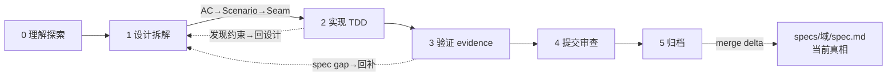
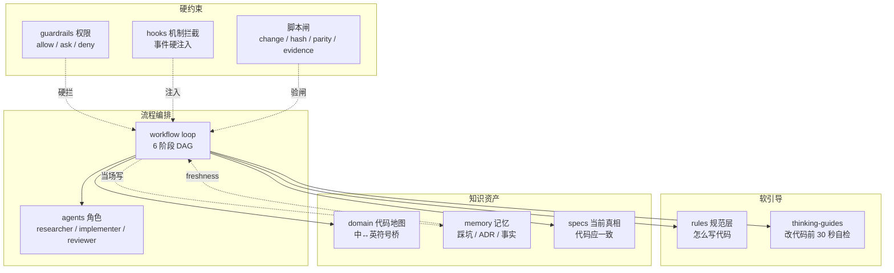

<div align="center">

# qey-harness

### 项目级 AI 编码协作工程框架

**让 AI 写代码从"偶尔惊艳、经常闯祸"变成"稳定交付、可审计、可复盘"**

`Agent = Model + Harness` · Model 决定能力上限，qey-harness 决定下限有多稳


</div>

---

## 为什么需要

AI 写代码很快，但每次会话都从零开始——不知道项目结构、不记得踩过的坑、不遵守你的规范。Skill 封装和 Subagent 派活解决了 **"能力"** 问题，却解决不了 **"纪律"** 和 **"可审计"** 问题。

| 痛点 | 裸用 AI / 纯 Skill+Agent | 有 qey-harness |
|------|--------------------------|----------------|
| **找代码** | codegraph 搜中文，0 结果；全局 grep 找半天 | 先查 domain 术语表（中↔英桥）→ 拿符号 → codegraph 验证，**几秒定位** |
| **重复踩坑** | 昨天踩的坑今天又踩 | memory 记坑，一次写成所有人（含 AI）绕开 |
| **假完成** | checkbox 手工勾，号称"测了" | TDD evidence 闸（RED/GREEN/回归 + commit hash），**不验不算完** |
| **知识腐烂** | domain-map 过时，AI 照旧地图找错路 | freshness 标记 + hook 提醒核实 + **更新优先于追加** |
| **多平台 drift** | Claude 配一份、Codex 配一份，改了忘了同步 | canonical + 薄包装 + 软链，**改一处全平台生效** |
| **没有真相** | 文档散落，谁也说不清"当前行为是什么" | specs/ 永远有一份**演进的当前真相** |

> **核心心法**：文档给 AI 判断方向，机制拦确定性违规。qey-harness 不是"再加规范"，是**把规范变机制**——让 AI 想跳也跳不过。

---

## 特性

### 🏗️ 单一真相源（specs + changes）

项目永远有一份**演进中的当前真相**，不再是散文件堆积：

```
specs/            当前行为真相（代码应一致；归档时 merge delta 而来）
changes/<id>/     进行中的变更（proposal + design + tasks + delta）
changes/archive/  已归档（delta 已 merge 进 specs/）
```

### 🧠 事件驱动记忆（不靠收尾仪式）

踩坑、决策在**事情发生的 loop 步骤当场写**——bug 排查第 6 步、设计 Stage 1。不拖到 `/recap`。每条记忆带 `freshness`（last_verified + source），过时**可见**而不静默误导。

### 🧪 TDD 证据闸（防假绿）

```
AC（验收标准）→ Scenario（Given/When/Then）→ Seam（测哪个接口）→ evidence
```

evidence = RED（因正确原因失败）+ GREEN + 回归 + commit hash。**完成 = evidence 齐，不是 checkbox 勾**。归档时脚本用 `git rev-parse` 实查 hash，编造过不了闸。

### ⚙️ 机制强制（不只靠 AI 自觉）

| 脚本 | 强制什么 |
|------|---------|
| `change.sh` | change 生命周期（建骨架 → 验 evidence → merge delta → 移 archive） |
| `hash-check.sh` | 文件漂移检测（SHA256，不查版本号；版本内演进也能抓） |
| `parity-check.sh` | 多 adapter drift 自检（软链 / 薄包装 / 路径 / manifest） |
| `evidence.sh` | TDD 证据校验（RED + GREEN + 回归 + commit hash） |
| `find-code-reminder.sh`（hook） | 用户"找代码"时 prompt 硬注入"先 domain 拿符号" |

### 🔗 多 adapter 闭环（改一处全平台生效）

Claude Code / Codex / omp / 通用 Agent，**canonical + 薄包装 + 软链**：

- `AGENTS.md` → 软链 `CLAUDE.md`（单源）
- `.codex/hooks` → 软链 `.claude/hooks`（单 hook）
- `source-command-*` → 薄包装指向 canonical（不嵌命令体）

### 🎯 精准上下文

- **domain-first 铁律**：domain 是 hint，代码是 truth；先 domain 拿符号 → codegraph 验证 → 不一致回写
- **implement.jsonl / check.jsonl**：每个 change 独立上下文清单（实现读啥 vs 检查读啥，关注点分离）
- **置信度标记**（observed / inferred / unknown）：init 扫描时标可信度

### 🤖 subagent 角色分工

| 角色 | 职责 | 边界 |
|------|------|------|
| **researcher** | 调研：domain-first 定位 + 链路 + 影响面 + 边界 | 只读，禁改任何文件 |
| **implementer** | 实现：按 Scenario TDD red→green，填 evidence | 禁 commit，交 reviewer 审 |
| **reviewer** | 审计：spec compliance + evidence 真实性 | 禁写代码 / commit |

### 🖥️ CLI 统一入口

```bash
qey-harness <cmd>   # 不用记脚本路径；alias qh='qey-harness'
```

---

## 快速开始

### 安装

**方式 A — npx 直接用(推荐)**:

```bash
npx qey-harness init          # 在项目目录跑,模板随 npm 包,无需 clone
npx qey-harness@latest init   # 指定版本
```

**方式 B — 全局安装**:

```bash
npx qey-harness@latest init   # 或 npm i -g qey-harness,之后任意目录直接用 qey
qey init
```

**方式 C — curl 一键脚本(无需 npm)**:

```bash
curl -fsSL https://raw.githubusercontent.com/limingqiang-git/qey-harness/main/install.sh | bash
```

脚本自动:克隆到 `~/.qey-harness` → 软链 `qey` 到 `~/.local/bin` → 检查 PATH。

### 🆕 新项目

```bash
cd /path/to/your-project

qey init                    # 接入骨架(复制 .qey + adapter)+ 提示跑 /qey:scan

# 在 AI IDE 里扫描填充:
/qey:scan                   # AI 扫描项目 → 填充 domain/knowledge/specs → 生成 CLAUDE.md + settings
```

**5–10 分钟拿骨架**（quick 全景），`deep` 模式 15–30 分钟扫透数据层 + 调用链。

### 🔄 已接入项目（查 / 同步最新）

```bash
qey doctor                  # 体检:版本/漂移/adapter/依赖
qey update                  # 同步最新模板
```

---

## 工作流（6 阶段 DAG）



| 阶段 | 核心动作 | 人工参与 |
|------|---------|---------|
| 0 **理解探索** | 搞清业务上下文 + 过需求澄清 checklist | `[必须人工]` |
| 1 **设计拆解** | 建 change（proposal + design + tasks + delta）；AC→Scenario→Seam | `[必须人工]` 审 |
| 2 **实现** | 按 Scenario TDD red-green-refactor | `[AI 自动]` 看 |
| 3 **验证** | 每 Scenario 填 evidence（RED + GREEN + 回归 + commit hash） | `[人审]` 确认 |
| 4 **提交审查** | Review 闸（完成度 = AC 绿）+ git 提交 | `[必须人工]` |
| 5 **归档** | merge delta 进 specs/ → 移 archive/ → 归档 frontmatter | `[必须人工]` |

**3 个硬闸**（过渡前置条件，不可跳）：

- 🚫 **无批准 Scenario → 不实现**（Stage 1→2）
- 🚫 **无 evidence → 不归档**（Stage 3→5）
- 🚫 **Intent 变了 → 新建 change**，不偷偷改原 change（防 scope creep）

---

## 架构

### 治理子系统全景



### 四类分工

| 类型 | 组成 | 作用 |
|------|------|------|
| **软引导** | `rules` + `thinking-guides` | 告诉 AI 怎么做对 |
| **硬约束** | `guardrails` + `hooks` + 脚本闸 | 拦住确定性违规，不可绕过 |
| **知识资产** | `domain` + `memory` + `specs` | 项目长记性、有真相 |
| **流程编排** | `workflow` + `agents` | 怎么走、谁来做 |

---

## 目录结构

```
.qey/                      # 项目内 harness 骨架（attach 时复制进来）
├── rules/                         # 编码规范（按场景精准加载，不全塞 AI）
│   ├── index.md                   #   路由表
│   ├── 代码定位决策树.md            #   LSP / codegraph / grep 任务匹配
│   ├── 各层规范.md                  #   分层骨架
│   ├── backend/                   #   后端分层
│   ├── database/                  #   数据库规范
│   ├── 安全/错误/日志/注释/外部调用/git提交规范.md
│   └── thinking-guides/           #   改代码前 30 秒思维触发
│       ├── cross-layer-thinking.md       #   跨层影响？
│       ├── state-machine-thinking.md     #   漏状态转换？
│       ├── boundary-thinking.md          #   边界（空/null/并发）？
│       └── code-reuse-thinking.md        #   有没有现成的？
│
├── domain/                        # 代码地图（how：结构/入口/术语/流程/状态）
│   ├── domain-map.md              #   目录权威映射
│   ├── 业务术语.md                  #   中文↔英文符号桥（glossary）
│   ├── 业务流程.md                  #   流程地图（每域一行）
│   ├── 状态流程.md                  #   状态机（mermaid）
│   └── 业务领域/<域>.md            #   深潜（常改/复杂/易踩坑的域）
│
├── specs/                         # 当前行为真相（what：代码应一致）
│   └── <域>/spec.md               #   行为契约 + 不变量 + Quality Check
│
├── changes/                       # 变更工作区
│   ├── _template.md               #   change 模板
│   ├── 归档_template.md            #   12 段归档模板
│   ├── <id>/                      #   进行中（proposal+design+tasks+delta+change.json）
│   └── archive/<id>/              #   已归档（delta 已 merge 进 specs/）
│
├── memory/                        # 项目记忆（why / 坑 / 事实）
│   ├── 项目级记忆.md                #   架构 / 约定 / 高风险区
│   ├── 踩坑记录/                   #   坑账本（bug-loop 第 6 步当场写）
│   ├── 业务演进/                   #   ADR（为什么；dev-loop Stage 1 当场写）
│   └── journal/                   #   会话机械日志（/qey-recap log）
│
├── workflow/                      # 流程 loop
│   ├── 新需求开发-loop.md          #   6 阶段 规格驱动↔TDD DAG（含 3 硬闸）
│   ├── 需求澄清-checklist.md       #   Stage 0 边界/状态机/事务/AC 清单
│   └── bug排查-loop.md            #   复现→根因→回归
│
├── agents/                        # subagent 角色（各有 persona + 边界）
│   ├── researcher.md              #   调研（只读）
│   ├── implementer.md             #   实现（TDD）
│   └── reviewer.md                #   审计（查 evidence）
│
├── guardrails/permissions.md      # 权限种子（allow / ask / deny 三档）
├── commands/                      # canonical slash 命令（三 adapter 薄包装指向这里）
│   ├── qey-init.md                #   扫描填充
│   ├── qey-commit.md              #   sh 引擎 + AI 起草提交
│   ├── qey-recap.md               #   log（机械日志）/ distill（知识提炼）
│   └── qey-update.md              #   模板升级
│
├── manifest.json                  # 文件分类注册表（overwrite vs diff_only）
├── change.sh                      # change 生命周期脚本
├── hash-check.sh                  # SHA256 文件漂移检测
├── parity-check.sh                # 多 adapter 自检
├── evidence.sh                    # TDD 证据闸校验
├── migrations/                    # 版本迁移（1.1→1.7）
└── version           # 模板版本
```

---

## 使用示例

### 日常：接一个新需求

```
用户："帮我加个支付重构功能"

AI 会话（按 dev-loop 6 阶段）：
  Stage 0  意图识别 + 过需求澄清-checklist（边界/状态机/事务/AC）
  Stage 1  设计拆解 → 建 change → 填 proposal/design/tasks/delta
           → 填 implement.jsonl / check.jsonl（实现/检查各读啥）
  Stage 2  TDD 实现：每 Scenario red→green，tasks.md 填 evidence
  Stage 3  验证：AC 逐条 evidence 齐 + spec 回溯
  Stage 4  提交：/qey-commit（起草→勾选→MR）
  Stage 5  归档：qey-harness change archive pay-refactor
           → 验 evidence → merge delta → 移 archive → parity
```

### 找代码（"订单预处理在哪"）

```
用户问 → hook 自动注入："💡 先 domain 拿英文符号"

AI 执行：
  ① grep domain/业务术语.md → 命中：OrderPrecheck, app/Service/OrderPrecheck/
  ② codegraph_search("OrderPrecheck") → 确认符号 + callers
  ③ 回答：入口 OrderAfterDealProcessService::precheckProducer(:137)

3 步、几秒（不再 codegraph 搜中文 + 并行发散）
```

### 查看 change 状态

```bash
qey-harness change list
# ID                       STATUS       PRI  DOMAIN       CREATED
# pay-refactor             archived     P1   订单         2026-07-20  📦
# bug-callbacklost         in_progress  P2   支付         2026-07-19
```

---

## CLI 命令速查

| 命令 | 什么时候 | 干啥 |
|------|---------|------|
| `install` | 一次性 | 软链到 `~/.local/bin` |
| `attach [--adapter]` | 新项目 | 接入骨架（claude / codex / pi / all） |
| `init [deep\|drill X]` | 新项目填充 | 提示跑 `/qey-init`（AI 命令） |
| `upgrade` | 老项目 / 漂移 | 同步 + 结构迁移（交互式 + backup） |
| `rename` | v1 改名 | `.harness` → `.qey` |
| `update` | 查漂移 | 只读 hash-check |
| `check` | 自检 | 漂移 + adapter parity |
| `status` | 看 change + 漂移 | change list + hash summary |
| `change create <id> [域]` | 新需求 | 建 change 骨架 |
| `change list` | 看 change | 列所有 + 状态 |
| `change archive <id>` | 归档 | 验 evidence + merge delta + 移 archive |
| `version` | 查版本 | 模板 schema_version |
| `help` | 查命令 | 帮助 |

> **AI slash 命令**：`/qey-init`（扫描填充）· `/qey-commit`（起草提交）· `/qey-recap log|distill`（日志/提炼）· `/qey-update`（升级）

---

## 多平台支持

| 平台 | 支持 | 机制 |
|------|------|------|
| **Claude Code** | ✅ | CLAUDE.md + commands + hooks + settings |
| **Codex** | ✅ | AGENTS.md（软链 CLAUDE.md）+ source-command（薄包装）+ hooks |
| **omp / pi** | ✅ | RULES sticky + config 权限 + TS hooks + omp commands |
| **通用 Agent** | ✅ | `.agents/skills`（source-command 薄包装） |

> canonical 命令体只在 `.qey/commands/` 写一份。所有 adapter 做薄包装指向它——**改一处，全平台自动生效**。

---

## 成熟度模型

| 级别 | 特征 | qey-harness |
|------|------|-------------|
| L0 裸用 | 无资产 | — |
| L1 散件 | CLAUDE.md + 零散 skill | — |
| L2 规则 + 记忆 | rules + domain + memory + guardrails | ✅ init 后 |
| L3 流程自动化 | commands + workflow + change.sh | ✅ |
| **L4 自演化** | hook 自动 + 自巡检 + 漂移自检 | **✅ parity + hash-check + 会话 hook + SHA256** |

---

## FAQ

**Q: scanner 扫描结果不准怎么办？**
A: `/qey-init` 跑完后让你确认，可以改。scanner 是辅助不是最终答案——harness 靠 `/qey-recap` 持续修正。

**Q: 没有 codegraph 索引能用吗？**
A: 能。scanner 用 Read/grep 也行，只是没 codegraph 精准。建议对大项目先建 codegraph 索引。

**Q: 适合非 PHP 项目吗？**
A: 适合。6 阶段 loop + 规格↔测试融合 + HITL 是**语言无关**的通用流程。settings 基础（rm -rf deny / git push ask）通用，技术栈特定项由 `/qey-init` 按检测结果自动追加。

**Q: 多人团队怎么共享？**
A: `.qey/` + `.claude/` 随 git 进仓库，团队所有人 clone 下来就有了。每个人踩的坑写进 memory，全团队受益。

**Q: 模板升级会覆盖我的内容吗？**
A: 不会。`/qey-update` 把文件分两类：通用文件（workflow/rules/commands）覆盖前 diff 给你看；项目填充文件（domain/memory/CLAUDE.md）只 diff 不覆盖。**项目实例内容永远不丢**。

---

## 设计哲学

```
文档给 AI 判断方向，机制拦确定性违规
```

| 不是 | 而是 |
|------|------|
| 在 prompt 里写"请验证 e2e" | 归档脚本 `change.sh archive` 查 evidence，没有不过闸 |
| 在 prompt 里写"记得记坑" | bug-loop 第 6 步是结构化步骤，跳了就不算完成 |
| 每个平台配一份 | canonical + 薄包装 + 软链，改一处全生效 |
| checkbox 勾 = 完成 | evidence 齐 = 完成（RED + GREEN + 回归 + commit hash） |
| 收尾时 `/recap` 回忆 | 事情发生时当场写（事件驱动），`/recap` 只查过期 |

---

## 版本历史

### 2.0.0 — 工程化重构 + npx 分发

**CLI 工程化**
- Node CLI 薄壳(`qey`)+ bash 引擎,零运行时依赖
- `npx qey-harness init` 直接用,模板随 npm 包发布,无需 clone
- 数据驱动升级链(扫 migrations/ 目录,出新版加文件即可)
- `manifest.json` 单一真相源(消灭三处文件清单副本)

**命令重构**
- CLI:`qey init` / `update` / `doctor` / `change` / `status` / `verify`
- AI 命令:`/qey:scan` / `/qey:commit` / `/qey:log` / `/qey:distill`(冒号风格)
- 砍掉冗余:install / rename / 假 init / check / hash-check / parity-check

**目录调整**
- 项目内目录从 `.qey-harness/` 简化为 `.qey/`,命令和目录名统一
- 记忆目录拆分:团队共享知识(`knowledge/`)、会话流水日志(`journal/`)、个人偏好(`memory/`)分开存放
- 新增门禁脚本目录(`guards/`)和模板目录(`templates/`)
- 修复 macOS / Linux 脚本兼容问题

**记忆保鲜机制**
- `qey verify`:自动检测知识过期(符号/路径锚点 + 置信度过滤)
- 知识强制带验证锚点(`Class::method` + `last_verified`)
- specs 从纯自然语言 → 带签名/契约/断点的可验证结构

**质量增强**
- 模板 + 范例分离(`_template.md` 结构 + `_example.md` 质量标杆)
- TDD 反模式清单(实现耦合 / 同义反复 / 水平切片)
- 需求澄清从一次性 checklist → 全程持续 sharpening
- CONTEXT.md 统一术语入口(glossary only)
- Scenario ⇌ test 名 1:1 映射(唯一机器可断言的硬交点)
- session-handoff(会话交接) + feature_list 聚合视图(`qey status`)

### 1.x — 早期演进(个人学习用,已升级 2.0,不再维护)

| 版本 | 重点 |
|------|------|
| **1.7** | 多 agent 通讯黑板协议 + omp adapter TS hooks |
| **1.6** | canonical 抽取 + 三 adapter 平等 + pi omp 独有机制 |
| **1.5** | sh 引擎与归档重构:commit/archive/evidence 脚本 |
| **1.2** | 统一 Change 生命周期:specs + changes + archive |
| **1.1** | 目录收拢;commit 参数化;permissions 种子化 |

---

## License

MIT
